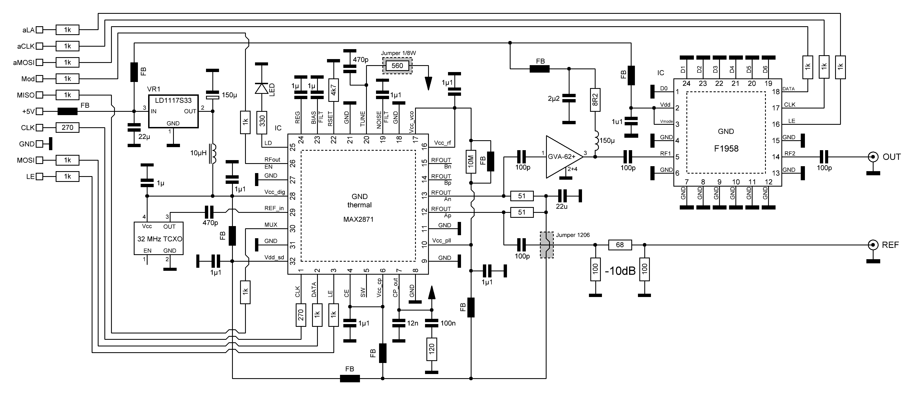
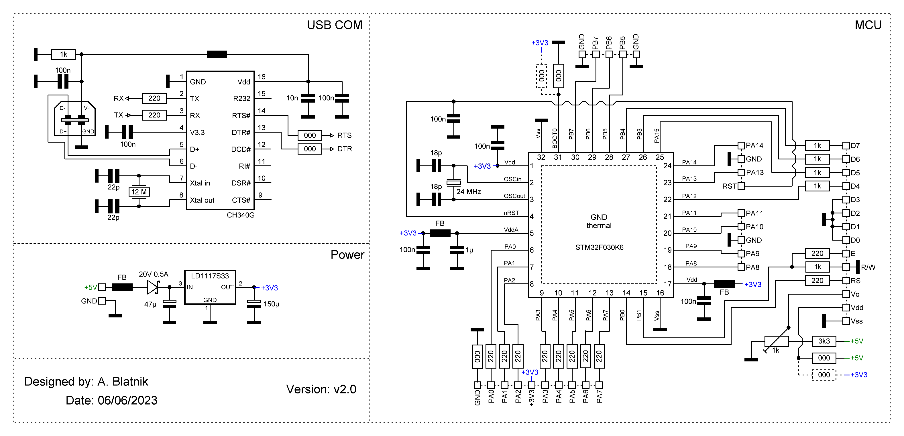

# DIY 6 GHz RF signal generator

## What's the difference?
You have probably seen this kind of the RF signal source devices before. They come as a cheap module from Ebay or Aliexpress, sometimes included with GUI on a touch screen. Although they are easy to obtain, most of them lack serious shielding making them unusable in any serious RF measurement setup. 

This prototype is based on a [S53MV design from 2017](http://lea.hamradio.si/~s53mv/fpll/fpll.html). The design was well tested by students over the past couple of semesters as it became a key building block in the composition of the laboratory practicum. Unfortunately, the original design contains some shortcomings as it uses few outdated components that are very hard to get. At the same time all of the (otherwise very good) microcontroller code is written in ARM7TDMI assembly, which is a nightmare for an unskilled engineer to fix.

This project uses up-to-date components that are available from almost all major online retailers, adds power calibration and refreshed GUI look, while maintaining 100% compatibility with the original S53MV design. The microcontroller source code was re-written in pure C using an EmBitz development enviroment and all PCBs have the same dimensions as the original S53MV prototype.
## How to use it?
There are two ways of controlling this RF generator. The first one is with four buttons located on the front panel and the second one is via serial interface (remote commands) in the form of a plain ASCII text. Regardless of the method used, all functionalities are available, although controlling via a serial connection opens up the possibility of automation with, for example, a Python script.
#### Front buttons
There is only one menu screen constantely displayed consisting of all information needed for quick manipulation. You can move the position of a cursor with left and right buttons. Current position is marked with an underline symbol. Not all 16 characters in a LCD row can be altered though and only numbers can be changed. Frequency can be adjusted between 0 - 7 GHz with 1 kHz resolution but some setting might not produce successfull PLL lock as MAX2871 is specified only up to 6 GHz. A question mark `?` will appear in upper left display area if an unlock condition is detected. Power setting depends on calibration values and is frequency dependant. Maximum output power at a specific frequency is measured during a calibration process and a -30 dB in 1 dB step can be additionally inserted.
#### Serial connection
## How to construct it?

## How it's designed?

### RF block
At the heart of the design lies the now well-known MAX2871 fractional PLL loop with a built-in bank of silicon oscillators. The output signal is amplified by a GVA-62+ amplifier, although we can use any other MMIC component in the same package. The output power is adjusted with the digital attenuator F1958 in a 0 dB to -30 dB range. The reference clock is provided by a 32 MHz crystal, preferably in the form of a TCXO (multiple SMD package sizes fit on the same PCB footprint). The entire circuit is powered from the +5V line. A +3.3V voltage rail is provided by one LD1117S33 (tested for the lowest noise level). FB indicates SMD ferrite bead with the highest resistance @ 100 MHz available to us.

### MCU
The STM32F030K6 was chosen as the main MCU because at the time of development it was the cheapest microcontroller with the required features to implement the project. It is controlling a simple user interface on a classic 2x16 symbol LCD screen (version with larger letters) and four buttons (up, down, left, right). It sets the registers of the PLL chip via serial bus, controls the attenuator, and generates AM modulation (100% depth) for the RF output and reference BNC connection at the back of the device (TTL 3.3V). USB to RS-232(TTL) IC CH340G is also added to the same PCB for the remote control via Virtual COM port (see listed commands below).

### Making changes
