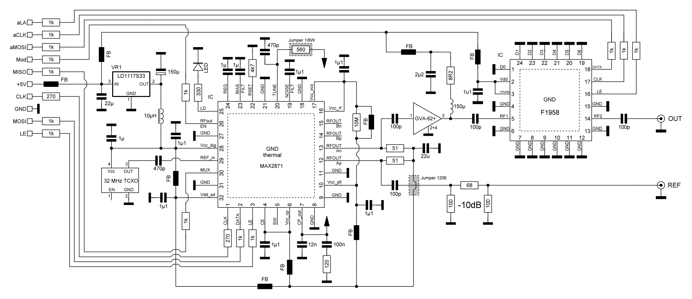

# DIY 6 GHz RF signal source

## What's the difference?
You have probably seen this kind of the RF signal source devices before. They come as a cheap module from Ebay or Aliexpress, sometimes included with GUI on a touch screen. Although they are easy to obtain, most of them lack serious shielding making them unusable in any serious RF measurement setup. 

This prototype is based on a [S53MV design from 2017](http://lea.hamradio.si/~s53mv/fpll/fpll.html). The design was well tested by students over the past couple semester as they became key building blocks in the composition laboratory practicum. Unfortunately, the original design contains some shortcomings. It uses few outdated components that are very hard to get, and at the same time, all the (otherwise very good) microcontroller code is written in an ARM7TDMI assembly, which is a nightmare for the unskilled engineer to fix.

This design uses up-to-date components available from almost all major online retailers, adds power calibration and GUI refresh, while maintaining 100% compatibility with the original S53MV version. The microcontroller source code was re-written in pure C using a free to use development enviroment EmBitz. All PCBs are in the same final dimensions as the original S53MV prototype.

### RF block
At the heart of the design lies the now well-known MAX2871 fractional PLL loop with a built-in bank of silicon oscillators. The output signal is amplified by a GVA-62+ amplifier, although we can use any other MMIC component in the same package. The output power is adjusted with the digital attenuator F1958 in a 0 dB to -30 dB range. The reference clock is provided by a 32 MHz crystal, preferably in the form of a TCXO (multiple SMD package sizes fit on the same PCB footprint). The entire circuit is powered from the +5V line. A +3.3V voltage rail is provided by one LD1117S33 (tested for the lowest noise level). FB indicates SMD ferrite bead with the highest resistance @ 100 MHz available to us.

### MCU

6 GHz CW RF source device based on a MAX2871, STM32F030K6 and F1958
