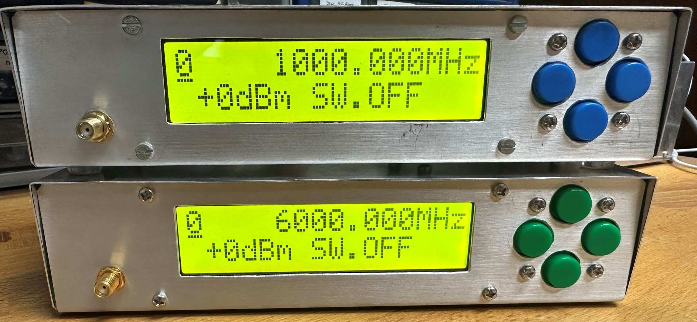
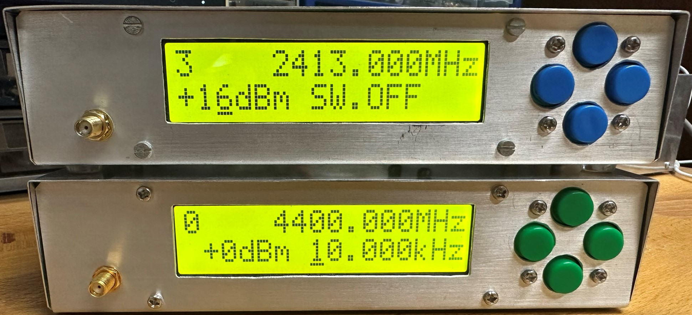
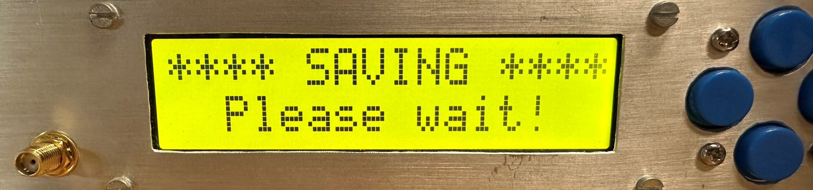

# DIY 6 GHz RF signal generator

## What's the difference?
You have probably seen this kind of RF signal source device before. They come as cheap modules from Ebay or Aliexpress, usually with built-in graphical interface on a touch screen. Although they are easy to obtain, most of them lack serious shielding, making them unusable in any serious RF measurement setup. 

This prototype is based on a [S53MV design](http://lea.hamradio.si/~s53mv/fpll/fpll.html) from 2017. The design was well tested by students over the past couple of semesters as it became a key building block in the composition of the laboratory practicum. Unfortunately, the original contains some shortcomings as it uses a few outdated components that are very hard to get. At the same time, all of the (otherwise very good) microcontroller code is written in pure assembly (ARM7TDMI), which is a nightmare for an unskilled engineer to fix.

This project uses up-to-date components that are available from almost all major online retailers, adds power calibration and refreshed GUI look, while maintaining 100% compatibility with the original S53MV design. The microcontroller source code was re-written in pure C using an EmBitz development environment and all PCBs have the same dimensions as the original S53MV prototype.
## How to use it?
There are two ways of controlling this RF generator. The first one is with four buttons located on the front panel, and the second one is via serial interface (remote commands). Regardless of the method used, all functionalities are available, although controlling via a serial connection opens the possibility of automation with, for example, a Python script.
#### Front buttons
There is only one menu screen constantly displayed with all the information needed for quick manipulation. You can move the position of a cursor (marked with an underline symbol) with the left and right buttons. Not all 16 characters on an LCD row can be altered though as only numbers can be changed. Frequency can be adjusted between 0 - 7 GHz with 1 kHz resolution (some settings might not produce a successful PLL lock as MAX2871 is specified only up to 6 GHz). A question mark `?` will appear in the upper left if the unlock condition is detected. The power setting depends on the calibration value and is frequency dependent. Maximum output power at a specific frequency is measured during a calibration process, and a maximum of -30 dB attenuation can be inserted (1 dB step size). Optional AM modulation (square wave, 100% depth, 50% duty cycle - specified up to 10 kHz) can be turned on, ranging from 1 Hz to 50 kHz (1 Hz resolution). The default state is `SW.OFF` meaning CW output with no modulation. The cursor will automatically jump to the bottom or upper line when reaching the end of the screen.

After powering up, the generator starts at default program 0, denoted with `0` in the uppermost left position of a screen. There are a total of 10 different program locations (0-9) with all of them being able to hold their own frequency, amplitude, and modulation settings. The user can therefore prepare different scenarios and quickly switch between them. All program values are stored in RAM, so power loss or a reset command will erase them. Pressing both the left and right buttons together will save the data from RAM to a flash memory inside the MCU. Please keep in mind that the STM32F030 series has limited flash write cycles (typically around 1000), after which the memory location will probably fail. Saving is intended only occasionally. A write is performed only if there is a change between the RAM and the Flash memory. On power-up, the program memory stored in flash is transferred to RAM.

It is not possible to obtain 1 kHz frequency resolution above 750 MHz. The LCD will then periodically display the set and achievable frequency, which is calculated by the MCU and is as close as possible to the desired frequency.
#### Serial connection
CH340G is added to the main PCB board for a USB-to-Serial (TTL) bridge. A virtual COM port appears on all major operating systems. The default baud rate is 9600 bps, no parity, and 1 stop bit. Commands are presented below.
| Syntax  | Command description |
| ------------- | ------------- |
| `help`  | Lists out all commands with a brief description |
| `A xxx`  | Amplitude setting in dBm including a `-` or `+` sign  |
| `F xxxxxxx`  | Frequency in kHz  |
| `M xxxxx`  | Modulation in Hz  |
| `S x`  | Select program location (0-9) |
| `P 123456789`  | Save to Flash |
| `R`  | MCU software reset (might not work at hard-fault) |
| `Att xxx`  | Attenuator raw value (used at calibration) |

All commands must end with a `\n` or an `Enter key` press. Please be aware that there is almost no error correction implemented in a command decode function. Serial commands are meant for automation not for the user input via a command prompt. Device can go into Hard fault mode if the wrong command syntax is entered. A power reset will solve the problem.

Upon power-up the baisc diagnostic data is sent first. Model `RF source 6 GHz\r\n` and version `v2.1\r\n` followed by a status report `0 ? 6000000kHz 0dBm 0Hz` or `0   5961010kHz -11dBm 11011Hz` (for example) if the PLL managed to lock (no `?` symbol). The First number denotes the selected program, followed by PLL lock status, frequency, output power, and modulation. The status line is automatically sent when any of the four front buttons are pressed.

Note that this RF generator is intended to work in CW mode with limited sweep possibilities. It can be done with a remote control (manual sweeping over a frequency range). Faster baud rates won't improve sweep times as PLL lock conditions aren't instantaneous.
## How to construct it?

There are two main PCB boards (RF and MCU). The RF circuit board is constructed on a 0.6 mm double-sided FR4 with the bottom being unetched to serve as a ground plane. It could be easily replicated with a DIY home method, e.g., toner transfer or photo method. MAX2871 and F1958 are soldered first using hot air. A 3 mm diameter hole is drilled in the middle of the footprint so the ground pad of the device can be soldered to the ground plane with a thin copper strip and a generous amount of solder. This serves as a good RF connection to ground and a heat dissipation pad (working better than any vias in professional design!). Other components are soldered next. The circuit is first tested, then put inside a brass housing, covered with a microwave absorber (black foam used as a shipping material for most IC packaging) and a brass or copper cover. For even better RF shielding, you can tape the metal cover with conductive aluminium tape. Shielding is an important step in preventing RF signals from exiting the device anywhere else but out of the front SMA connector.

The requirements for the MCU board are very sparse. It can be constructed on a single layer 1 mm or 1.6 mm FR4 and mounted directly to the final enclosure without the need for an RF shield. Connections to other peripherals are made with flat-flex cable and a standard pin-header ladder to form a cheap connector. Four buttons are mounted on a separate PCB board.
Everything is enclosed in a home-made aluminium box (1 mm semi-soft sheet). Find the stencil for drilling and bending above. To cover the enclosure, a 0.6 mm thick sheet is used. The device casing serves as a heat sink for a linear regulator and can get warm to the touch after an extended period. The figure below shows the connections between the printed circuit boards.

The detailed construction method is quite similar to the original S53MV design. You can find the procedure description [here](http://lea.hamradio.si/~s53mv/fpll/fpll.html). Note that only construction technique is similar, as PCBs have been completely redesigned. The LCD screen looks to be screwed too firmly to the housing in the image from the inside of the device (above), causing the screen to flex. This is a flaw that, in the long term, leads to screen failure owing to the loss of connections between the glass panel and the PCB, and it must be avoided during construction!

All PCBs were designed in SprintLayout 6.0. You can find the free viewer version online. Try printing masks directly from the viewer, as other programs might alter dimensions.  

## How it is designed?

### RF block
At the heart of the design lies the now well-known MAX2871 fractional PLL loop with a built-in bank of silicon oscillators. The output signal is amplified by a GVA-62+ amplifier, although we can use any other MMIC component in the same package. The output power is adjusted with the digital attenuator F1958 in a 0 dB to -30 dB range. The reference clock is provided by a 32 MHz crystal, preferably in the form of a TCXO (multiple SMD package sizes fit on the same PCB footprint). The entire circuit is powered from the +5V line. A +3.3V voltage rail is provided by one LD1117S33 (tested for the lowest noise level). FB indicates an SMD ferrite bead with the highest resistance @ 100 MHz available to us.

### MCU
The STM32F030K6 was chosen as the main MCU because, at the time of development, it was the cheapest microcontroller with the required features to implement the project. It controls a simple user interface on a classic 2x16 symbol LCD screen (version with larger letters) and four buttons (up, down, left, and right). It sets the registers of the PLL chip via serial bus, controls the attenuator, and generates AM modulation (100% depth) for the RF output and reference BNC connection at the back of the device (TTL 3.3V). USB to RS-232(TTL) IC CH340G is also added to the same PCB for the remote control via Virtual COM port (see listed commands below).

